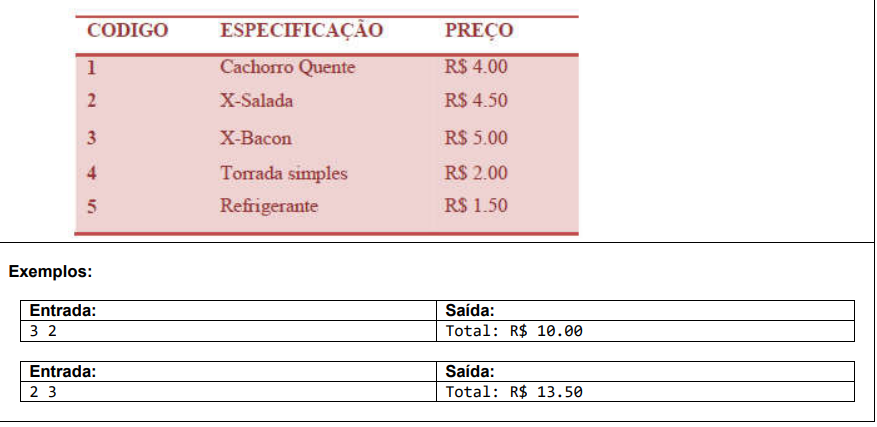
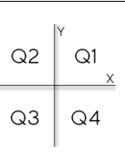

# Exercícios propostos:

### Exercício 01

**Fazer um programa para ler um número inteiro, e depois dizer se este número é negativo ou não.**

### Exercício 02

**Fazer um programa para ler um número inteiro e dizer se este número é par ou ímpar.**

### Exercício 03

**Leia 2 valores inteiros (A e B). Após, o programa deve mostrar uma mensagem "Sao Multiplos" ou "Nao sao Multiplos", indicando se os valores lidos são múltiplos entre si. Atenção: os números devem poder ser digitados em ordem crescente ou decrescente.**

###  Exercício 04

**Leia a hora inicial e a hora final de um jogo. A seguir calcule a duração do jogo, sabendo que o mesmo pode começar em um dia e terminar em outro, tendo uma duração mínima de 1 hora e máxima de 24 horas.**

### Exercício 05

**Com base na tabela abaixo, escreva um programa que leia o código de um item e a quantidade deste item. A seguir, calcule e mostre o valor da conta a pagar.**

###  Exercício 06

**Você deve fazer um programa que leia um valor qualquer e apresente uma mensagem dizendo em qual dos seguintes intervalos ([0,25], (25,50], (50,75], (75,100]) este valor se encontra. Obviamente se o valor não estiver em nenhum destes intervalos, deverá ser impressa a mensagem “Fora de intervalo”.**

###  Exercício 07

**Leia 2 valores com uma casa decimal (x e y), que devem representar as coordenadas de um ponto em um plano. A seguir, determine qual o quadrante ao qual pertence o ponto, ou se está sobre um dos eixos cartesianos ou na origem (x = y = 0). Se o ponto estiver na origem, escreva a mensagem “Origem”. Se o ponto estiver sobre um dos eixos escreva “Eixo X” ou “Eixo Y”, conforme for a situação.**

###   Exercícios 08

**Em um país imaginário denominado Lisarb, todos os habitantes ficam felizes em pagar seus impostos, pois sabem que nele não existem políticos corruptos e os recursos arrecadados são utilizados em benefício da população, sem qualquer desvio. A moeda deste país é o Rombus, cujo símbolo é o R$. Leia um valor com duas casas decimais, equivalente ao salário de uma pessoa de Lisarb. Em seguida, calcule e mostre o valor que esta pessoa deve pagar de Imposto de Renda, segundo a tabela abaixo.**

**Lembre que, se o salário for R$ 3002.00, a taxa que incide é de 8% apenas sobre R$ 1000.00, pois a faixa de salário que fica de R$ 0.00 até R$ 2000.00 é isenta de Imposto de Renda. No exemplo fornecido (abaixo), a taxa é de 8% sobre R$ 1000.00 + 18% sobre R$ 2.00, o que resulta em R$ 80.36 no total. O valor deve ser impresso com duas casas decimais.**

