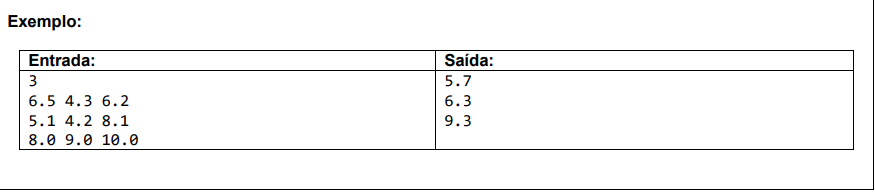

# Exercícios sobre estrutura repetitiva for

### Exercício 01

**Leia um valor inteiro X (1 <= X <= 1000). Em seguida mostre os ímpares de 1 até X, um valor por linha, inclusive o X, se for o caso.**

### Exercício 02 

**Leia um valor inteiro N. Este valor será a quantidade de valores inteiros X que serão lidos em seguida. Mostre quantos destes valores X estão dentro do intervalo [10,20] e quantos estão fora do intervalo, mostrando essas informações conforme exemplo (use a palavra "in" para dentro do intervalo, e "out" para fora do intervalo).**

### Exercício 03

**Leia 1 valor inteiro N, que representa o número de casos de teste que vem a seguir. Cada caso de teste consiste de 3 valores reais, cada um deles com uma casa decimal. Apresente a média ponderada para cada um destes conjuntos de 3 valores, sendo que o primeiro valor tem peso 2, o segundo valor tem peso 3 e o terceiro valor tem peso 5.**

### Exercício 04

**Fazer um programa para ler um número N. Depois leia N pares de números e mostre a divisão do primeiro pelo segundo. Se o denominador for igual a zero, mostrar a mensagem "divisao impossivel".**

### Exercício 05

**Ler um valor N. Calcular e escrever seu respectivo fatorial. Fatorial de N = N * (N-1) * (N-2) * (N-3) * ... * 1. Lembrando que, por definição, fatorial de 0 é 1.**

### Exercício 06

**Ler um número inteiro N e calcular todos os seus divisores.**

### Exercício 07

**Fazer um programa para ler um número inteiro positivo N. O programa deve então mostrar na tela N linhas, começando de 1 até N. Para cada linha, mostrar o número da linha, depois o quadrado e o cubo do valor, conforme exemplo.**

