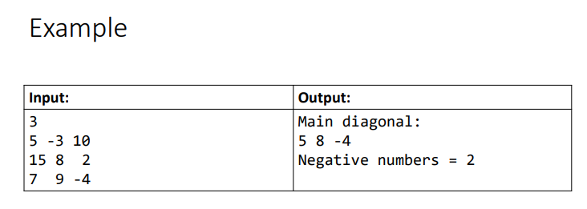

# Exercício resolvido

**Fazer um programa para ler um número inteiro N e uma matriz de ordem N contendo números inteiros. Em seguida,mostrar a diagonal principal e a quantidade de valores negativos da matriz.**

