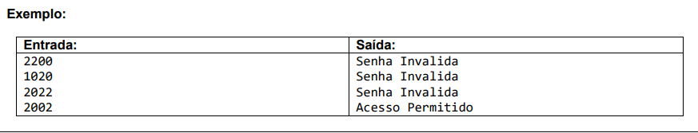
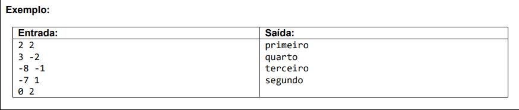
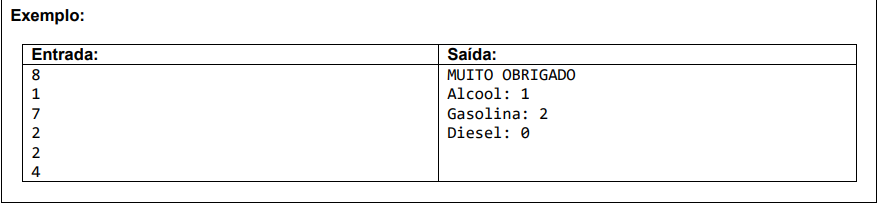

# Exercícios sobre estrutura repetitiva while

### Exercício 01

**Escreva um programa que repita a leitura de uma senha até que ela seja válida. Para cada leitura de senha incorreta informada, escrever a mensagem "Senha Invalida". Quando a senha for informada corretamente deve ser impressa a mensagem "Acesso Permitido" e o algoritmo encerrado. Considere que a senha correta é o valor 2002.**

### Exercício 02

**Escreva um programa para ler as coordenadas (X,Y) de uma quantidade indeterminada de pontos no sistema cartesiano. Para cada ponto escrever o quadrante a que ele pertence. O algoritmo será encerrado quando pelo menos uma de duas coordenadas for NULA (nesta situação sem escrever mensagem alguma).**

### Exercício 03

**Um Posto de combustíveis deseja determinar qual de seus produtos tem a preferência de seus clientes. Escreva um algoritmo para ler o tipo de combustível abastecido (codificado da seguinte forma: 1.Álcool 2.Gasolina 3.Diesel 4.Fim). Caso o usuário informe um código inválido (fora da faixa de 1 a 4) deve ser solicitado um novo código (até que seja válido). O programa será encerrado quando o código informado for o número 4. Deve ser escrito a mensagem: "MUITO OBRIGADO" e a quantidade de clientes que abasteceram cada tipo de combustível, conforme exemplo.**

